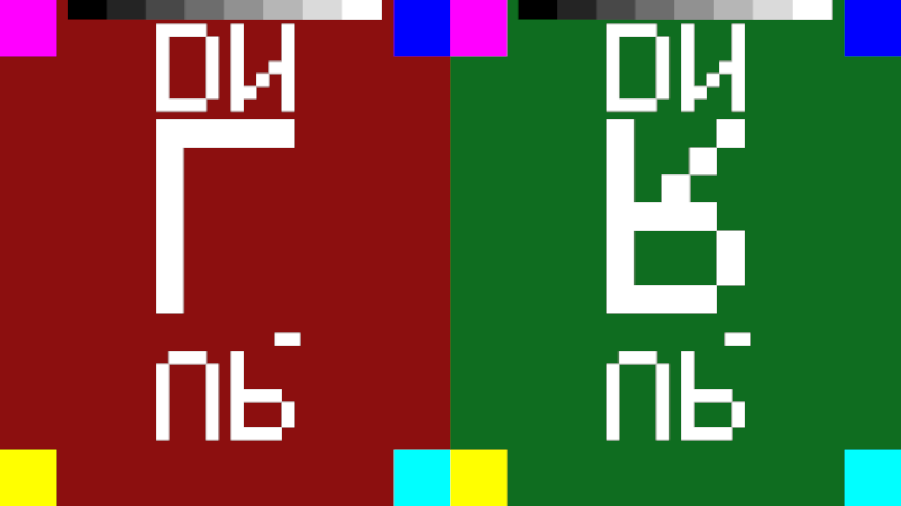
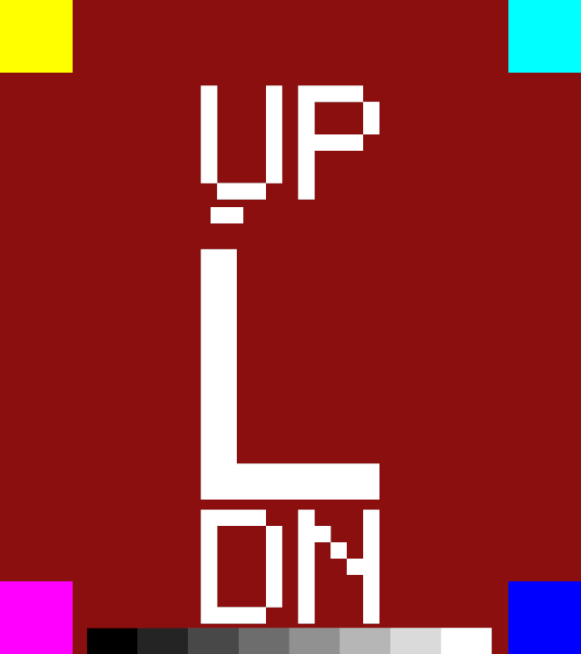

# Experiment 6 — see what the compositor received

**Question.** Experiment 5 got 600 frames × 2 eyes into `monado-service` and
proved, by GPU readback, that the submitted surfaces held the colours we drew.
Everything it checked, it checked *before* `Submit`. So three bugs would have
passed it silently:

* an **eye swap** — left content presented to the right eye;
* a **vertical flip** — D3D9 is top-down, `pBounds` was `NULL` and untested;
* a **colour-space error** in xrizer's blit — sRGB applied twice, say.

All three are miserable to diagnose wearing a headset and trivial to spot on a
monitor. So: make the compositor output observable, then use it to answer *is
the left eye's content in the left eye, and is up still up?*

**Answer: the chain is correct as it stands.** Reproduce with `./run.sh`.

| | |
|---|---|
| **Eye order** | **CORRECT** — the left eye's content is in the left eye |
| **Vertical orientation** | **CORRECT** — up is up. `pBounds = NULL` is right; do **not** flip `v` |
| **Horizontal orientation** | **CORRECT** — no mirroring |
| **Colour** | **CLEAN** — an eight-step grey ramp survives end to end, worst step off by **0/255** |

Nothing needed fixing. That is a weaker-sounding result than "found and fixed a
flip", so most of the work here went into making it a *measurement* rather than
an assumption: two control runs feed the chain deliberately wrong input and
require the photograph to come back visibly wrong. See "The control runs" below.

One thing did turn up that a real mod has to know about: **xrizer ignores
`Submit`'s `pBounds`**. Texture bounds cannot be used to flip, crop, or pack
both eyes into a single render target on this stack.


Monado's own compositor output, photographed off the X server while the 32-bit
probe was submitting. Left half = left eye, right half = right eye.

---

## Verdict

| Link | State |
|---|---|
| Monado's compositor output visible on screen at all | **PASS** — three defects in the way, all worked around locally |
| Screenshot is of the compositor, not of something else | **PASS** — dimensions verified, and the control runs change it |
| Left eye's content in the left eye (side-by-side view) | **PASS** |
| Left eye's content in the left eye (**left eye shown alone**) | **PASS** — independent of any assumption about the layout |
| Up is up, in both eyes | **PASS** |
| No horizontal mirror, no 180° rotation | **PASS** |
| Grey ramp preserved 0…255 | **PASS** — exact |
| Control: submitting eye 0's texture as `Eye_Right` swaps the halves | **PASS** |
| Control: drawing the pattern upside down produces an upside-down picture | **PASS** |
| `Submit(pBounds = v-flipped)` changes anything | **NO** — **xrizer ignores `pBounds` entirely**, see below |
| Real HMD, real game | still not attempted |

---

## Getting a picture at all

Experiment 5 recorded that Monado logged `X11(XCB) Windowed selected!` and built
a surface swapchain, but that no window ever appeared under
`xwininfo -root -children`. Three separate things were wrong, and none of them
is what that note implies.

### 1. The window is not called "Monado"

Monado's `XRT_WINDOW_PEEK` window — `src/xrt/compositor/main/comp_window_peek.c`
— is an SDL window titled **after the HMD**, so on this machine it is called
**`Simulated HMD`**, and so is the `mutter-x11-frames` frame around it. Searching
the window list for "Monado" or "peek" finds nothing, on a desktop that has 700+
X windows and where 500 of them are unnamed 1×1 helpers. Matching on `WM_CLASS`
is unambiguous:

```sh
xwininfo -root -tree | grep '("monado-service" "monado-service")'
        0x750000a "Simulated HMD": ("monado-service" "monado-service")  1280x720+14+49  +3200+397
```

That one line is the whole difference between "no visual channel exists" and
"here is a photograph".

### 2. The peek surface cannot be created — `VK_KHR_xlib_surface`

```
DEBUG [comp_window_peek_create] Creating peek window from both eye(s)
ERROR [comp_window_peek_create] Failed to create SDL surface:
      VK_KHR_xlib_surface extension is not enabled in the Vulkan instance.
```

Two independently reasonable choices that are jointly fatal:

* Monado selects its instance extensions from the **window backend** it picked.
  With X11(XCB) that list contains `VK_KHR_xcb_surface` and not
  `VK_KHR_xlib_surface` (`comp_compositor.c: select_instance_extensions()`).
* The peek window is SDL2, and SDL2's X11 Vulkan backend commits to **Xlib**
  whenever the *ICD* advertises `VK_KHR_xlib_surface` — `SDL_x11vulkan.c` only
  falls back to xcb when that extension is absent from
  `vkEnumerateInstanceExtensionProperties`. The NVIDIA ICD here advertises both,
  so SDL calls `vkCreateXlibSurfaceKHR` against an instance that never enabled
  it. There is no SDL hint to force the xcb path.

### 3. The peek swapchain cannot be created — `VK_PRESENT_MODE_MAILBOX_KHR`

```
ERROR [check_surface_present_mode] Requested present mode not supported.
ERROR [comp_window_peek_blit] comp_target_acquire: VK_ERROR_INITIALIZATION_FAILED
```

`comp_window_peek` asks for `MAILBOX`. The NVIDIA driver does not offer it on an
X11 surface — measured with `vulkaninfo` on this machine, an X11 surface reports
exactly:

```
Present Modes: count = 4
        PRESENT_MODE_FIFO_KHR
        PRESENT_MODE_FIFO_RELAXED_KHR
        PRESENT_MODE_IMMEDIATE_KHR
        UNKNOWN_VkPresentModeKHR_value1000361000     # FIFO_LATEST_READY_EXT
```

Monado checks the requested mode against that list and gives up before it ever
calls `vkCreateSwapchainKHR`.

### The fix: one small Vulkan layer, loaded only by `monado-service`

`vkxlibsurface.c` (~200 lines, native x86-64, **not** part of the 32-bit chain
under test). It implements no Vulkan function of its own; it edits three things
in flight:

| hook | what it does |
|---|---|
| `vkCreateInstance` | appends `VK_KHR_xlib_surface` to `ppEnabledExtensionNames` |
| `vkGetPhysicalDeviceSurfacePresentModesKHR` | appends `MAILBOX` to the reported list |
| `vkCreateSwapchainKHR` | substitutes `IMMEDIATE` when `MAILBOX` is requested |

Both are non-blocking tearing-permitted modes, and this is a debug mirror
window. Monado itself is unmodified, nothing is installed system-wide, and
`run.sh` scopes the layer to the one process that needs it:

```sh
VK_LAYER_PATH=out VK_INSTANCE_LAYERS=VK_LAYER_BO1VR_xlib_surface monado-service
```

It announces itself so you can see it took effect:

```
[VK_LAYER_BO1VR_xlib_surface] vkCreateInstance: 8 extension(s) requested, appended VK_KHR_xlib_surface -> 0
DEBUG [comp_window_peek_create] Creating peek window from both eye(s)
[VK_LAYER_BO1VR_xlib_surface] vkCreateSwapchainKHR 1280x720: MAILBOX -> IMMEDIATE
```

Both are arguably Monado bugs worth reporting upstream: the peek window should
either request the instance extension SDL will actually use, or fall back to a
present mode the surface supports.

### And one trap in the screenshot itself

**Do not capture with ImageMagick's `import`.** It calls `XGrabServer` for the
duration of the capture. While the server is grabbed, `monado-service` cannot
present to its X11 swapchain, so the compositor stalls, the app blocks in
`WaitGetPoses`, and `import` waits for a window that can never repaint. That is
a three-way deadlock and **it takes the whole desktop with it** — every
subsequent `xwininfo` times out until the `import` process is killed. Measured
here, twice.

`xwd` is safe: `nm -D /usr/bin/xwd | grep -i grab` lists `XGrabPointer` and
`XUngrabPointer` and nothing else, and the `.xwd` → `.png` conversion afterwards
never touches X. `run.sh` uses `xwd`, wraps it in `timeout`, and **refuses any
capture whose dimensions are not the window's** — a capture tool that quietly
returns a whole monitor instead produces a screenshot that analyses as
"unreadable" rather than as "the capture failed", which is exactly the kind of
plausible-looking wrong answer this experiment exists to catch.

The peek window is also **not a stable X window**: Monado destroys and rebuilds
it when the compositor swapchain resizes, which happens while a session settles.
An id read a second earlier is a `BadDrawable`. `run.sh` re-resolves the id
before every capture attempt, and takes three shots two seconds apart rather
than one — the first often lands in the gap and logs `grab: gave up`, which is
expected and why there are three.

---

## The pattern

Two flat colours are not enough — they answer "which eye" and nothing else.
`visual.c` draws this into each eye's 896×1007 D3D9 render target, entirely with
`IDirect3DDevice9::Clear` over rect lists (no shaders, no vertex buffers, no
fixed-function state to get wrong):

```
+--------------------------------------------------+
| YELLOW |            U P             |    CYAN    |
+--------+                            +------------+
|            [ moving marker ->]                   |
|                                                  |
|                +-------+                         |
|                |   L   |   (R in the right eye)  |
|                +-------+                         |
|                                                  |
|                    D N                           |
+---------+                          +-------------+
| MAGENTA |  [grey ramp 0..255]      |    BLUE     |
+--------------------------------------------------+
 background: LEFT = dark red 0x8c1010, RIGHT = dark green 0x106e20
```

Each feature answers one question, and the four corner tags together answer
three:

| feature | catches |
|---|---|
| background colour, and the letter `L` / `R` | eye swap |
| yellow **top-left** | vertical flip (magenta would be there) |
| yellow top-left **and** cyan top-right | horizontal mirror (they would swap) |
| yellow top-left, not blue | 180° rotation |
| `UP` near the top, `DN` near the bottom | the same, legibly, for a human |
| grey ramp | colour space — a second sRGB conversion lifts the mid-tones far more than the ends, which is obvious in a ramp and invisible in a flat fill |
| marker stepping one notch right per frame | that the picture is live, not a stale frame |

`analyse.py` samples the same features out of the screenshot at the same
fractional coordinates and prints a verdict, so the answer does not depend on
anyone eyeballing it. `visual.c` prints what it *sent*, sampled at those same
points, before submitting:

```
  SENT eye0/LEFT : bg=0x8c1010  TL=0xffff00 TR=0x00ffff BL=0xff00ff BR=0x0000ff
  SENT eye0/LEFT : ramp = 00 24 48 6d 91 b6 da ff
  SENT eye1/RIGHT: bg=0x106e20  TL=0xffff00 TR=0x00ffff BL=0xff00ff BR=0x0000ff
  SENT eye1/RIGHT: ramp = 00 24 48 6d 91 b6 da ff
PASS-4: both render targets read back the pattern we drew, the way we drew it, before submit
```

so "sent" and "received" are the same table, side by side.

---

## What the runtime received

`out/peek_null_3.png`, analysed (`out/analysis_null.txt`, verbatim):

```
screenshot   : .../out/peek_null_3.png  1280x720
source eye   : 896x1007, peek half 640x720

LEFT half   background      (140, 15, 15)   -> the LEFT eye's colour (dark red), delta 1
LEFT half   corner TL      (255, 255, 0)   -> TL       yellow
LEFT half   corner TR      (0, 255, 255)   -> TR       cyan
LEFT half   corner BL      (255, 0, 255)   -> BL       magenta
LEFT half   corner BR      (0, 0, 255)     -> BR       blue
LEFT half   grey ramp       want   0  36  72 109 145 182 218 255
LEFT half                   got    0  36  72 109 145 182 218 255
RIGHT half  background      (15, 109, 32)   -> the RIGHT eye's colour (dark green), delta 1
RIGHT half  corner TL      (255, 255, 0)   -> TL       yellow
RIGHT half  corner TR      (0, 255, 255)   -> TR       cyan
RIGHT half  corner BL      (255, 0, 255)   -> BL       magenta
RIGHT half  corner BR      (0, 0, 255)     -> BR       blue
RIGHT half  grey ramp       want   0  36  72 109 145 182 218 255
RIGHT half                  got    0  36  72 109 145 182 218 255

EYE ORDER        : CORRECT -- the left eye's content is in the left eye
ORIENTATION left : CORRECT -- up is up, no mirroring
ORIENTATION right: CORRECT -- up is up, no mirroring
COLOUR           : CLEAN -- grey ramp survives end to end, worst step off by 0/255

RESULT: PASS
```

Every corner tag is where it was drawn, in both eyes. The backgrounds are within
1/255 of what was submitted. The grey ramp is **exact** — `0 36 72 109 145 182
218 255` in, the same out.

### Why no flip is needed, even though D3D9 is "top-down"

The premise in Experiment 5's *Not proven* section — "D3D9 is top-down and
OpenVR's convention is not, so a vertical flip is plausible" — does not survive
contact with this chain. Nothing in the path ever inverts a row:

* DXVK backs the D3D9 render target with a `VkImage` whose row 0 is the top row;
  D3D9's top-down texel convention and Vulkan's top-left image origin agree.
* xrizer copies that image into the OpenXR swapchain image with
  `vkCmdCopyImage` / `vkCmdBlitImage` — a straight image copy.
* Monado samples the swapchain image with the same origin convention.

The place a flip *is* usually needed is OpenGL, whose framebuffer origin is
bottom-left; that is why `VRTextureBounds_t{0,1,1,0}` exists. We submit
`TextureType_Vulkan`, not `TextureType_OpenGL`. **`pBounds = NULL` is correct
and should stay `NULL`** — which is just as well, because it turns out to be the
only thing that works (below).

### The control runs — proving the camera is pointed at the compositor

A photograph that looks right proves nothing unless a wrong input produces a
visibly wrong photograph. Two runs exist purely to establish that.

**Control 1 — swap the eyes.** `BO1VR_SWAP_EYES=1` submits eye 0's texture as
`Eye_Right` and eye 1's as `Eye_Left`, changing nothing else. The two halves of
the picture must swap:


```
LEFT half   background      (15, 109, 32)   -> the RIGHT eye's colour (dark green), delta 1
RIGHT half  background      (140, 15, 15)   -> the LEFT eye's colour (dark red), delta 1
...
EYE ORDER        : SWAPPED -- left content is being presented to the right eye
ORIENTATION left : CORRECT -- up is up, no mirroring
ORIENTATION right: CORRECT -- up is up, no mirroring
COLOUR           : CLEAN -- grey ramp survives end to end, worst step off by 0/255
```

Green `R` on the left, red `L` on the right — the halves swapped, and nothing
else moved.

**Control 2 — draw the pattern upside down.** `BO1VR_DRAW_FLIP=1` mirrors every
rect about the horizontal centre line *inside our own D3D9 texture*, so the
readback at frame 0 now expects magenta in the top-left and asserts it. The
picture must come back upside down:



```
  SENT eye0/LEFT : bg=0x8c1010  TL=0xff00ff TR=0x0000ff BL=0xffff00 BR=0x00ffff
...
LEFT half   corner TL      (255, 0, 255)   -> BL       magenta  <-- expected TL
LEFT half   corner TR      (0, 0, 255)     -> BR       blue     <-- expected TR
LEFT half   corner BL      (255, 255, 0)   -> TL       yellow   <-- expected BL
LEFT half   corner BR      (0, 255, 255)   -> TR       cyan     <-- expected BR

EYE ORDER        : CORRECT -- the left eye's content is in the left eye
ORIENTATION left : VERTICALLY FLIPPED -- the image is upside down
ORIENTATION right: VERTICALLY FLIPPED -- the image is upside down
```

Every corner tag is diagonally opposite where the `null` run put it, the letters
are mirrored top-to-bottom, `DN` is at the top, and the grey ramp has moved from
the bottom edge to the top. (`analyse.py` also reports `COLOUR: SHIFTED` for this
run — it samples the ramp where the ramp is supposed to be, and the ramp is no
longer there. That is the control working, not a colour error.) The eye order is
untouched.

Together these say: the screenshot is of what we submitted; eye routing is
observable and correct; and the vertical axis is genuinely being read, so "up is
up" in the `null` run is a measurement and not a coincidence. Note also what did
*not* change in each — swapping the eyes left orientation alone, and flipping
the drawing left the eye order alone.

### xrizer ignores `pBounds` — the control that wasn't

This was written first, as the vertical control: submit
`VRTextureBounds_t{ uMin=0, vMin=1, uMax=1, vMax=0 }` instead of `pBounds =
NULL` and expect an upside-down picture. **It produced a pixel-identical
picture.** Not "the same verdicts" — identical pixels:

```python
>>> from PIL import Image, ImageChops
>>> a = Image.open('images/peek_null_3.png').convert('RGB')
>>> b = Image.open('images/peek_vbounds_3.png').convert('RGB')
>>> ImageChops.difference(a, b).getbbox()
(295, 227, 1011, 247)          # only the moving marker's 20-pixel-tall lane
>>> c = Image.open('images/peek_swap_3.png').convert('RGB')
>>> ImageChops.difference(a, c).getbbox()
(0, 0, 1280, 720)              # the eye-swap control, for comparison
```

The only region that differs between the `NULL` run and the `v`-flipped run is
the horizontal lane the frame counter's marker walks along — i.e. the two
screenshots were taken on different frame numbers, and nothing else moved at
all.

That is not a capture artefact. The bounds pointer demonstrably crosses the
wine boundary; Proton's own trace, from `out/console_vbounds.txt` and
`out/console_null.txt` in the same pair of runs:

```
# BO1VR_FLIP_V=1
0154:trace:vrclient:winIVRCompositor_IVRCompositor_029_Submit _this 00085730, eEye 0,
      pTexture 0063FC4C (eType 2), pBounds 0063FD4C, nSubmitFlags 0
# pBounds = NULL
0158:trace:vrclient:winIVRCompositor_IVRCompositor_029_Submit _this 00085690, eEye 0,
      pTexture 0063FC4C (eType 2), pBounds 00000000, nSubmitFlags 0
```

A non-NULL `pBounds` arrives at `vrclient`, and the composited result does not
move by one pixel. **xrizer discards it.**

Consequences for the mod, and they are not small:

* texture bounds cannot be used to correct an orientation — the fix would have
  to be in how the game's frame is rendered or copied;
* the common "render both eyes into one wide texture and submit it twice with
  different `uMin`/`uMax`" pattern **will not work**: both eyes would receive
  the whole texture. Two separate per-eye render targets, as used here, are
  required;
* and this is exactly the class of bug this experiment was built to catch. A
  `Submit` that ignores a parameter still returns `VRCompositorError_None`.

This is worth reporting upstream to xrizer.

### The eye-order cross-check

Reading "left half = left eye" off a side-by-side view assumes something about
the view's layout. So the third run sets `XRT_WINDOW_PEEK=left`, which puts the
**left eye alone** in the window:



```
screenshot   : .../out/peek_left1_3.png  640x720
source eye   : 896x1007, shown alone (XRT_WINDOW_PEEK=left)

LEFT eye    background      (140, 15, 15)   -> the LEFT eye's colour (dark red), delta 1
LEFT eye    corner TL      (255, 255, 0)   -> TL       yellow
LEFT eye    corner TR      (0, 255, 255)   -> TR       cyan
LEFT eye    corner BL      (255, 0, 255)   -> BL       magenta
LEFT eye    corner BR      (0, 0, 255)     -> BR       blue
LEFT eye    grey ramp       want   0  36  72 109 145 182 218 255
LEFT eye                    got    0  36  72 109 145 182 218 255

EYE ORDER        : CORRECT -- the LEFT eye alone was displayed and it holds the LEFT eye's content
ORIENTATION left : CORRECT -- up is up, no mirroring
COLOUR           : CLEAN -- grey ramp survives end to end, worst step off by 0/255

RESULT: PASS
```

Dark red background, letter `L`, yellow in the top-left. The left eye holds the
left eye's content, with no assumption about how the pair is laid out.

---

## What Monado saw, per frame

Unchanged from Experiment 5's method, and still the cross-check that the frames
are real — five runs of 2400 frames each:

```
== 7. what MONADO saw (per-frame, from its own trace log)
   DEBUG [comp_swapchain_create_init] CREATE 0x764424008ba0 896x1007 VK_FORMAT_B8G8R8A8_SRGB (50)
   DEBUG [comp_swapchain_create_init] CREATE 0x7adc34008ba0 896x1007 VK_FORMAT_B8G8R8A8_SRGB (50)
   swapchain_acquire_image : 12000
   swapchain_release_image : 12000
   LAYER_COMMIT            : 12042
   frames we submitted     : 12000
```

12000 acquires and 12000 releases for 5 × 2400 submitted frames, on client
swapchains of exactly the per-eye size — and, this time, with a photograph of
what was in them.

Note the swapchain format Monado hands out: **`VK_FORMAT_B8G8R8A8_SRGB`**, while
the D3D9 render target's `VkImage` is `VK_FORMAT_B8G8R8A8_UNORM`
(`GetVulkanImageInfo` reports format 44). An sRGB view of UNORM content is
exactly the shape a double-conversion bug takes, which is why the grey ramp is
in the pattern. It comes back exact, so nothing in the chain is applying a
transfer function twice.

---

## The run, end to end

`./run.sh`'s closing block, verbatim:

```
== 9. result
   null    app PASS   picture reads exactly as drawn
   swap    app PASS   picture reads different from what was drawn
   dflip   app PASS   picture reads different from what was drawn
   left1   app PASS   picture reads exactly as drawn
   vbounds app PASS   picture reads exactly as drawn
   OK   THE ANSWER: eye order correct, up is up, no mirroring, colour clean
   OK   CONTROL: submitting eye 0's texture as Eye_Right swaps the two halves of
        the picture -- so the screenshot really is of what we submit
   OK   CONTROL: ...and swapping the eyes changes nothing else
   OK   CONTROL: drawing the pattern upside down in our own texture produces an
        upside-down picture -- so the vertical axis is genuinely observed, and
        'up is up' in the null run is a measurement and not a coincidence
   OK   with only the LEFT eye on screen, the left eye holds the left eye's
        content -- eye order confirmed without assuming which half of the
        side-by-side view is which
   NOTE Submit(pBounds = VRTextureBounds_t{0,1,1,0}) produced an IDENTICAL
        picture to pBounds = NULL: xrizer IGNORES pBounds. A mod cannot use
        texture bounds to flip, crop or pack eyes into one render target.
RESULT: PASS
```

Note the two `reads different` lines: those are the controls, and they are
required to read different. The `OK`/`BAD` lines are where each run is held to
what it was supposed to do.

---

## Reproduction

```sh
./run.sh                              # all five runs + analysis, ~10 minutes
BO1VR_MODES=null ./run.sh             # just the answer, ~2 minutes
BO1VR_MODES="null swap dflip" ./run.sh   # the answer and its two controls
BO1VR_FRAMES=6000 ./run.sh            # longer, if you want to watch it
BO1VR_RAISE=1 ./run.sh                # raise the peek window before capturing
BO1VR_DISPLAY=:0 ./run.sh             # different X server
WORK=/some/dir ./run.sh
```

Modes: `null` (the answer), `swap` and `dflip` (controls, must come out wrong),
`left1` (left eye alone), `vbounds` (the `pBounds` finding). Each is a full
2400-frame session with its own `monado-service`.

`run.sh` never writes inside the Steam install: it hard-link copies Proton into
`$WORK/proton` and patches only that copy (Experiment 4's two defects). It stops
the packaged `monado.socket` for the duration and restores it from an `EXIT`
trap, including on failure.

Artefacts, all under `out/` (gitignored) and copied to `images/` (tracked):

| file | what |
|---|---|
| `peek_<mode>_1..3.png` | the peek window, three times, two seconds apart |
| `analysis_<mode>.txt` | `analyse.py`'s reading of the last one |
| `analysis_<mode>.json` | the same, machine-readable |
| `visual_<mode>.log` | what the app did and what it sent |
| `console_<mode>.txt` | the `WINEDEBUG=+vrclient` trace and xrizer's logging |
| `$WORK/monado.log` | `monado-service` at `XRT_COMPOSITOR_LOG=trace` |

Analyse a screenshot on its own:

```sh
python3 analyse.py out/peek_null_3.png --rw 896 --rh 1007
python3 analyse.py out/peek_left1_3.png --rw 896 --rh 1007 --single left
```

`analyse.py` exits **0** when the picture reads exactly as drawn, **1** when it
reads cleanly but differs (an eye swap, a flip, a colour shift), and **2** when
it could not be read at all. Those are three different situations and run.sh
treats them as three, because "the capture failed" must never be mistaken for
"the compositor is wrong" or vice versa.

### Two traps worth knowing if you touch the capture path

* **Never use ImageMagick's `import` here.** It `XGrabServer`s; see above. It
  deadlocked this machine's desktop twice before that was diagnosed.
* **Do not stop `monado-service` with a single SIGTERM and assume it is gone.**
  It sometimes is not, and a survivor races the new instance for
  `$XDG_RUNTIME_DIR/monado_comp_ipc`, so the client can end up talking to the
  instance *without* the peek window while the script photographs the one with
  it. An early run of this script ended up with three live services and a set of
  screenshots that could not be attributed to any particular one. `run.sh` now
  escalates to SIGKILL and refuses to continue unless exactly one service is
  running.

---

## Environment this was verified on

| | |
|---|---|
| OS | Ubuntu 24.04.4 LTS, kernel 6.8, X11 (`DISPLAY=:1`), mutter compositing |
| GPU | NVIDIA RTX 3080 Ti, proprietary driver 595.84 |
| Proton | 10.0-4b, `PROTON_USE_WOW64=1`, + `tools/patch-proton-wow64-vrclient.py` |
| DXVK | v2.6.2-23-g3cb664e1260926e (the `d3d9.dll` Proton 10.0-4b installs) |
| OpenVR runtime | xrizer `be664bb`, from the WiVRn flatpak |
| OpenXR runtime | Monado 21.0.0 (`21.0.0+git2905.e26a272c1~dfsg1-2build2`), Simulated HMD |
| Vulkan loader | 1.3.275.0 |
| Interfaces | `IVRCompositor_029`, `IVRSystem_023` |
| Compiler (probe) | `i686-w64-mingw32-gcc` 13-win32, `-gdwarf-4`, unstripped |
| Compiler (layer) | system `cc`, x86-64 |
| Capture | `xwd` + ImageMagick `convert` + Pillow 10.2.0 |

---

## Not proven

* **Distortion and reprojection.** The Simulated HMD applies no distortion, so
  the peek view is a straight copy of the composited eye images. On real optics
  the compositor also warps; nothing here says anything about that.
* **Colour beyond a grey ramp.** The ramp is exact, which rules out a gamma or
  double-sRGB error. It does not rule out a subtler primaries/colour-space
  difference that happens to be identity on greys.
* **`pBounds` for anything but a full-frame flip.** Only `NULL` and
  `{0,1,1,0}` were submitted, and the latter had no effect. A partial sub-rect
  was not tried — but since a full inversion is ignored, there is no reason to
  expect a sub-rect to be honoured, and a mod should not plan on it.
* **Depth submission, `Submit_TextureWithPose`, array textures** — as in
  Experiment 5.
* **A real HMD**, and **`BlackOps.exe`** itself.
* **Whether Monado's own XCB compositor window ever maps.** It is not needed any
  more — the peek window is a better instrument, since it shows the eye images
  rather than the distorted display image — but the Experiment 5 mystery is
  still technically open. `comp_window_xcb` builds a working `VkSurfaceKHR` and
  a 3-image swapchain, yet no correspondingly sized window appears in
  `xwininfo -root -tree`. Not investigated further.
